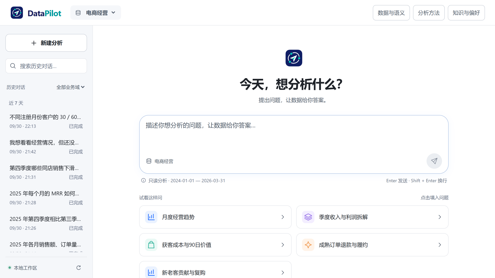
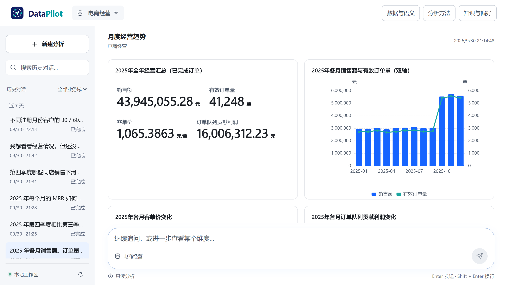
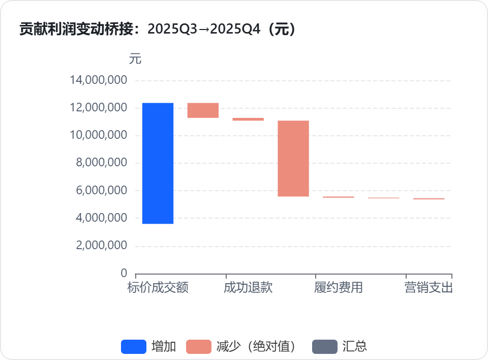
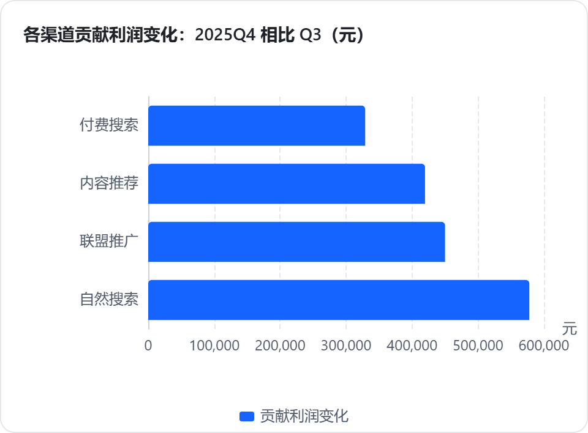
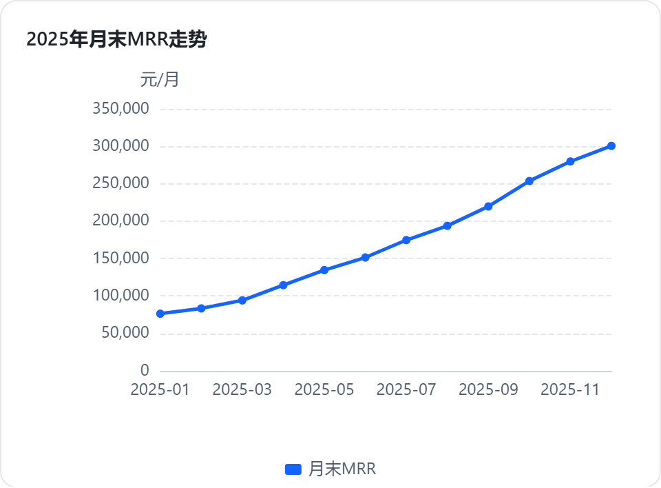
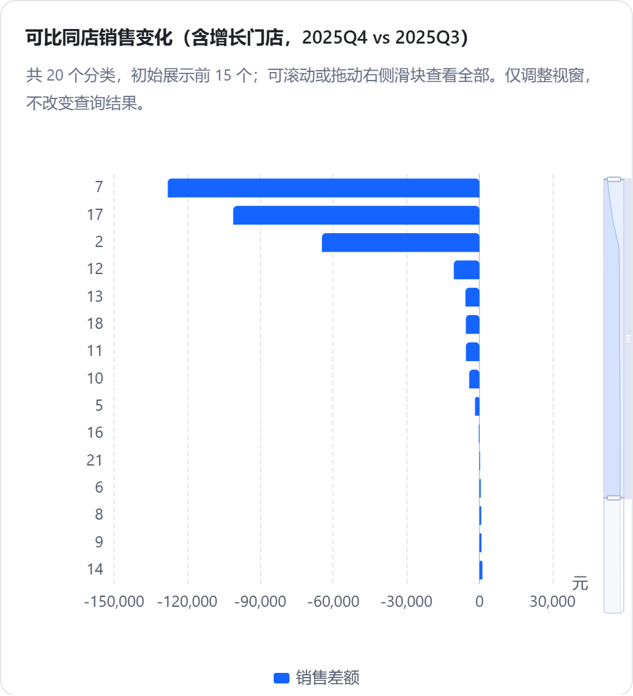
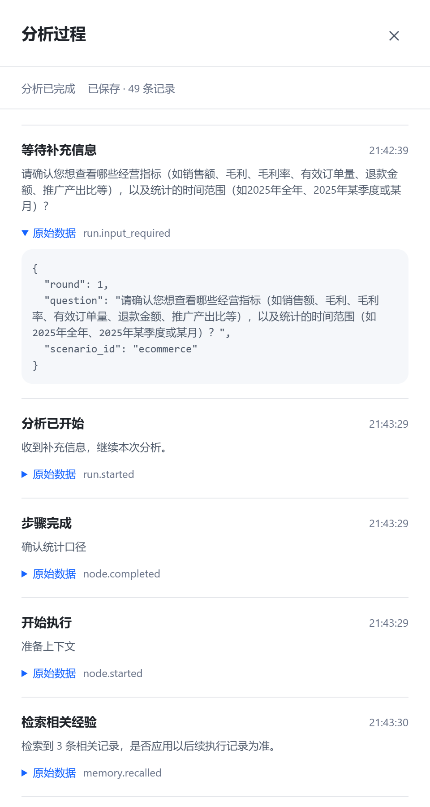
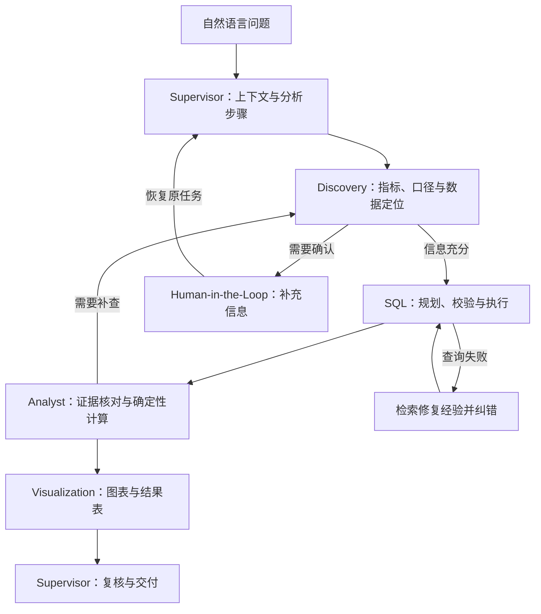

<p align="center">
  
</p>

<h1 align="center">DataPilot</h1>

<p align="center"><strong>让业务问题变成可核验的分析结果。</strong></p>

<p align="center">
  多智能体协作 · 自然语言分析 · 交互式澄清 · 证据追溯
</p>

<p align="center">
  <a href="#产品展示">产品展示</a> ·
  <a href="#核心能力">核心能力</a> ·
  <a href="#工作原理">工作原理</a> ·
  <a href="#快速启动">快速启动</a>
</p>

DataPilot 是基于 **LangGraph** 的多智能体数据分析工作台。业务人员通过自然语言提出问题，系统协作完成指标理解、跨表查询、证据分析和图表生成；遇到口径不明确的问题时，先向用户确认，再继续原任务。

项目以电商、SaaS 和连锁门店为业务实践，通过数据源、业务域、语义模型与 Skill 分层组织分析能力。

## 产品展示

### 用对话开启分析

统一的业务域入口、可搜索的历史对话，以及随时继续追问的输入框。数据与语义、分析方法、知识与偏好集中在顶部。



### 从问题到指标、趋势与明细

> 2025 年各月销售额、订单量、客单价和贡献利润如何变化？哪些月份值得重点关注？

KPI、趋势图和结果表围绕同一份查询证据组织，图表明确区分单位与坐标轴；SQL 和运行过程按需展开。



### 从总体变化下钻到业务对象

> 第四季度相比第三季度，销售额与贡献利润如何变化？按渠道、品类、折扣、退款和费用拆解。

先对齐订单、明细、退款和费用的统计粒度，再做贡献分解与金额核对，结合渠道和品类定位差异。

<table>
  <tr>
    <td width="50%"></td>
    <td width="50%"></td>
  </tr>
</table>

<details>
<summary><strong>查看更多：SaaS 收入、门店经营与交互式澄清</strong></summary>

#### SaaS：订阅收入分析

按月分析 MRR，区分新增、扩张、收缩、流失与恢复，并核对连续月份的收入桥接。



#### 门店：同店经营分析

围绕营业天数、日均客流、成交比例与客单价拆解同店变化，结合门店排名定位关注对象。



#### Human-in-the-Loop：口径确认与任务恢复

指标或时间范围不明确时，请求用户补充信息；使用检查点恢复原任务。下面展示已完成分析中的澄清、恢复与后续执行记录。



</details>

## 核心能力

- **多智能体协作**：Supervisor 组织流程，数据发现、SQL、分析和可视化 Agent 通过结构化产物协作。
- **一致的业务口径**：语义模型明确指标公式、事实粒度、时间字段与关联关系，支撑多指标和跨表分析。
- **交互式澄清**：通过 LangGraph `interrupt` 暂停任务，用户补充后恢复上下文并继续查询。
- **SQL 修复经验召回**：结合 PostgreSQL 全文检索、BGE-M3 向量检索与加权 RRF，召回已验证经验辅助定向纠错。
- **三层记忆管理**：工作流检查点、会话上下文与长期经验分层管理，兼顾任务恢复、多轮衔接和跨任务复用。
- **可追溯的结果交付**：确定性工具计算趋势与分解，图表关联查询结果；保留 SQL、结果表和执行事件。

## 工作原理



### 三层记忆

| 层次 | 组件 | 作用 |
| --- | --- | --- |
| 工作流状态 | PostgresSaver | 保存检查点与任务进度，支持暂停后的断点恢复 |
| 会话上下文 | PostgreSQL | 保留完整消息，以滚动摘要和近期窗口组织模型输入 |
| 长期经验 | PostgresStore | 管理业务知识、已启用偏好与验证后的 SQL 修复经验 |

长期经验原件存放在 PostgresStore，全文与向量索引由独立检索表承载。召回结果按业务域、版本与方言等条件筛选，并回查原件；实际修复且任务最终成功后，才沉淀运行经验。偏好按业务域和语义模型版本直接读取。

### Skill 与数据接入

18 个 Skill 按节点职责、意图标签和业务能力选择，组合通用分析方法与领域方法，实际加载内容记录在运行轨迹中。

PostgreSQL 与 DuckDB 通过统一连接器接入。业务域绑定数据源，语义模型组织指标、维度及批准关联；SQL 经过 AST 校验和只读执行控制，应用状态与记忆保存在独立的 PostgreSQL 中。

### 技术栈

| 模块 | 技术 |
| --- | --- |
| 后端与编排 | Python 3.12、FastAPI、Pydantic、LangGraph |
| 数据与查询 | PostgreSQL、DuckDB、SQLGlot |
| 检索与记忆 | PostgresSaver、PostgresStore、全文检索、BGE-M3、pgvector、RRF |
| 前端与可视化 | React、TypeScript、Vite、ECharts、SSE |

## 快速启动

以下为 **Windows / PowerShell 原生启动**步骤，命令均在项目根目录执行。

准备 Python **3.12.x**、Node.js **22**，以及已安装 **pgvector** 扩展文件的 PostgreSQL。`pgvector` 需与所使用的 PostgreSQL 安装匹配，初始化脚本不会代为安装它。

### 1. 安装依赖

```powershell
py -3.12 -m venv .venv
.\.venv\Scripts\python.exe -m pip install -e "./backend[dev]"
npm --prefix frontend ci
```

### 2. 配置模型

首次配置时复制模板；已有 `.env` 时直接编辑，保留原配置。

```powershell
if (-not (Test-Path .env)) { Copy-Item .env.example .env }
```

在 `.env` 中填写自己的模型连接信息：

| 配置项 | 用途 |
| --- | --- |
| `INSIGHT_LLM_BASE_URL`、`INSIGHT_LLM_API_KEY`、`INSIGHT_LLM_MODEL` | OpenAI 兼容协议的 LLM 服务 |
| `INSIGHT_EMBEDDING_BASE_URL`、`INSIGHT_EMBEDDING_API_KEY`、`INSIGHT_EMBEDDING_MODEL` | Embedding 服务，BGE-M3 / 1024 维 |

Embedding 用于增强语义检索；未配置或调用失败时使用全文检索，并在执行事件中记录检索方式。密钥只保存在本地配置中，不放入前端或提交到 Git。

### 3. 初始化独立应用数据库与业务数据

将下方路径替换为自己的 PostgreSQL `bin` 目录：

```powershell
.\.venv\Scripts\python.exe scripts/init_local_postgres.py --bin-dir "C:\path\to\PostgreSQL\bin"
.\.venv\Scripts\python.exe scripts/generate_data.py
```

脚本在项目的 `.runtime/postgres` 创建独立集群，使用端口 `15432` 与数据库 `insight_agents`。连接凭据自动保存在 `.runtime`，后端通过 `--local-postgres` 读取。已有业务数据文件按生成器规则复用。

### 4. 启动前后端

终端一：

```powershell
.\.venv\Scripts\python.exe scripts/dev.py --local-postgres
```

终端二：

```powershell
npm --prefix frontend run dev
```

- 打开工作台：<http://127.0.0.1:5174>
- 后端健康状态：<http://127.0.0.1:8010/api/v1/health>

首次启动会初始化应用表与内置业务域。截图展示的是已执行分析后的界面；新安装的工作区请提交问题生成自己的分析记录。生成业务数据、启动服务和读取历史不调用模型，新建分析时才调用 LLM。

<details>
<summary><strong>可选：安装领域记忆与检查模型连接</strong></summary>

运行中的后端提供 `POST /api/v1/templates/{template_id}/install`，显式安装对应模板的业务知识、偏好模板及验证后的修复经验；`template_id` 可取 `ecommerce`、`saas` 或 `retail`。配置 Embedding 后，这一步可能调用向量服务；偏好模板仍需用户启用。

下面的检查会发送真实 LLM 与 Embedding 请求，仅在需要验证模型配置时执行：

```powershell
.\.venv\Scripts\python.exe scripts/check_models.py --live
```

</details>

## 开发验证

常规离线测试与构建：

```powershell
.\.venv\Scripts\python.exe -m pytest backend/tests -q
npm --prefix frontend test
npm --prefix frontend run build
```

## 项目结构

```text
backend/insight/   Agent 工作流、API、连接器、分析工具与记忆
frontend/         对话工作台、结果图表与分析过程展示
scenarios/        业务模型、指标、关联与数据生成配置
skills/           通用与领域分析 Skill
scripts/          原生启动、初始化与验证入口
docs/images/      README 产品截图
```

核心实现入口：

- [多智能体工作流](backend/insight/workflow.py)
- [长期记忆与双路召回](backend/insight/memory.py)
- [SQL 校验与执行](backend/insight/sql.py)
- [连接器](backend/insight/connectors.py)
- [确定性分析工具](backend/insight/bi_analytics.py)
- [Skill 选择与加载](backend/insight/skills.py)

## 许可证

本项目采用 [MIT License](LICENSE)。
